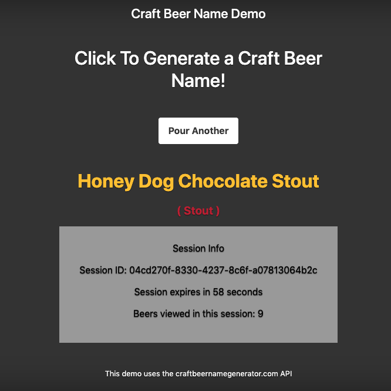

# redis-session-demo overview
Demo app that shows session management for a Node.js app using express-sessions and connect-redis. Originally created for Redis Day NYC 2019: https://events.redislabs.com/sessions/life-user-session/

The app queries an API for ML-generated craft beer names and displays them on the page. There is a session management panel that displays session ID, time until the session expires, and the number of beer names viewed in that session. 

# how to run

Make sure you have have Redis server running locally (and mysqld):

```
redis-server
```
Then clone this repo, run npm install and then run it in dev mode:

```
git clone https://github.com/jankleinert/redis-session-demo
cd redis-session-demo
npm install
export SESSION_SECRET=<some value you choose>
npm run dev
```

Then in your browser, go to http://localhost:3000. It should look something like this:



# how it works
This demo uses [express-session](https://github.com/expressjs/session) for session management and [connect-redis](https://github.com/tj/connect-redis) as the session store.

# branches
The *master* branch contains the app with simple session management.

The *auth* branch will add in authentication using passport.js.
